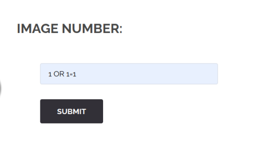
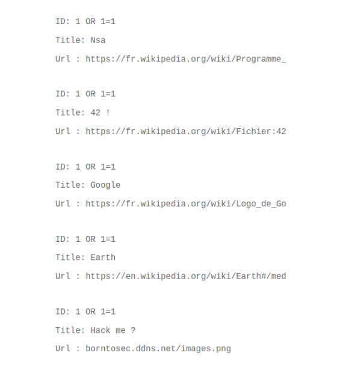
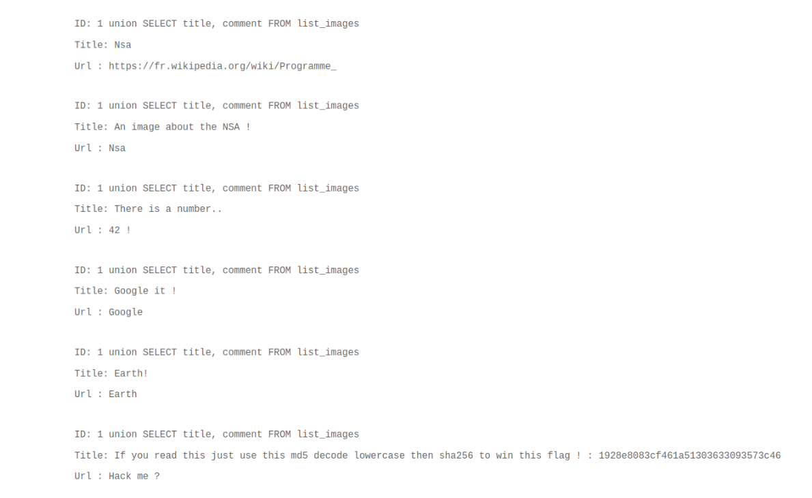

Sur la page qui permet de chercher une image via son numéro,  
on s'aperçoit que l'on peut faire de l'injection SQL dans le champ de recherche.

On va donc pouvoir récupérer les différentes colonnes et tables qui composent cette base de donnée avec cette requête dans le champ de recherche :

`1 union SELECT column_name, table_name FROM information_schema.columns`

Je vais vous épargner les différentes requêtes pour parcourir les différentes colonnes et seulement mettre la requête qui a permis de récupérer quelque chose d'intéressant :

`1 union SELECT title, comment FROM list_images`

Pour le dernier résultat, nous obtenons un hash et des instructions pour trouver le flag.

Après décryptage en md5 du hash, on obtient : albatroz
Plus qu'à passer le tout en lowercase puis de le sh256

Ça y est, on a le flag

Pour se protéger de ce genre de faille, on peut sanitize ce que l'on reçoit dans le backend et, par exemple dans le cas précis, refuser si on reçoit autre chose que ce qui est attendu, un nombre.