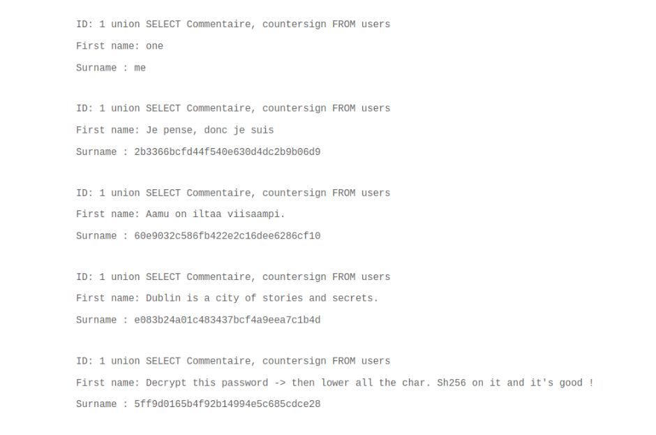

Sur la page qui permet de chercher un utilisateur via son id,  
on s'apercoit que l'ont peut faire de l'injection sql dans le champ de recherche.

on vas donc pourvoir recuperer les differentes colones et tables qui composent cette base de donnee avec cette requete dans le champ de recherche :

`1 union SELECT column_name, table_name FROM information_schema.columns`

je vais vous epargner les differentes requetes pour parcourir les differentes colonnes et seulement mettre la requetes qui a permis de recuperer quelque chose d'interessant :

`1 union SELECT Commentaire, countersign FROM users`

Pour le dernier resultat nous obtenon un hash et des instruction pour trouver le flag.

Apres decryptage en md5 du hash, on obtient : FortyTwo
Plus qu'a passer le tout en lowercase puis de le sh256

Ca y est on as le flag

Pour ce proteger de ce genre de faille, on peut sanitize ce que l'on resoit dans le backend et par exemple dans le cas precis, refuser si on recoit autre chose que ce qui est attendu, un nombre