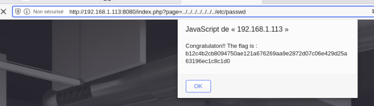

On observe sur l'url un parametre GET nommer page, on va s'en servir pour essayer de naviguer dans les dossier et remonter jusqu'as /etc/passwd par exemple.

On peut donc se balader sur l'arboressence de fichier du backend librement et donc obtenir sois des pages internet ou des fichier que l'on ne serais pas senser pouvoir avoir access

une solution, serait de verifier en backend ce que l'on recoit dans page et de le comparer a une liste de reponse valide.