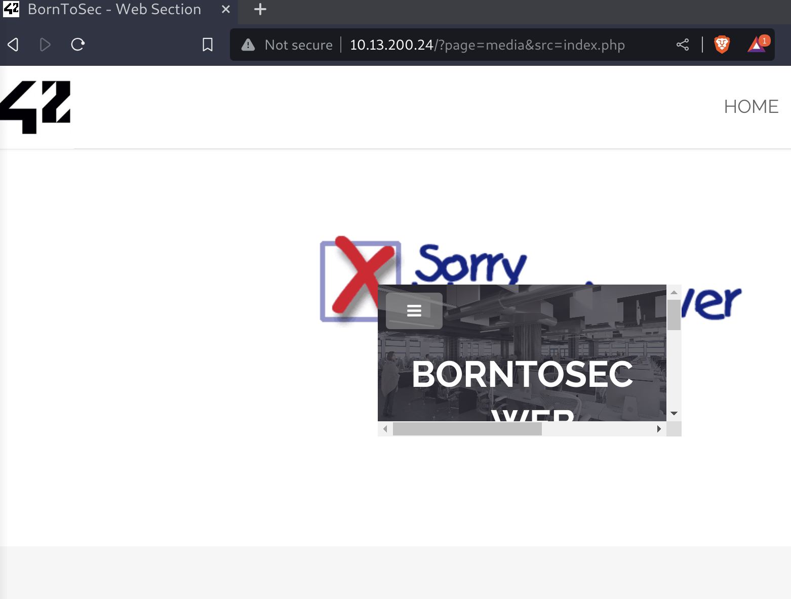

# Exploitation XSS Réfléchie via le Paramètre src
**Date de Découverte** : 13 mars 2024

## Contexte
Une vulnérabilité **XSS réfléchie** a été identifiée sur la page d'accueil de l'application ciblée, exploitant le paramètre src dans une URL pour exécuter du code JavaScript malveillant.

## Découverte Initiale
L'URL vulnérable identifiée grace a la possibilité de clique sur une image est :
- `http://10.13.200.24/?page=media&src=nsa`

Initialement, cette URL affichait un contenu local via :
- `<object data="http://10.13.200.24/images/nsa_prism.jpg"></object>`

En remplaçant la valeur du paramètre **src** par **index.php,** l'intégralité du site a été affichée dans la balise `<object>`, révélant une validation insuffisante du paramètre src.



## Exploitation de la Vulnérabilité

L'objectif était d'injecter et d'exécuter du code JavaScript arbitraire. Utilisant la syntaxe `data:` pour insérer des données en base64 directement dans la requête web, le script suivant a été encodé :
- `<script>alert("XSS")</script>`

L'outil utilisé pour encoder :
- `https://www.base64encode.net/file-to-base64`

Le script encodé en base64 :
- `PHNjcmlwdD5hbGVydCgiWFNTIik8L3NjcmlwdD4=`

A été inséré dans l'URL via le mediatype **text/html**, résultant en :

```
http://10.13.200.24/?page=media&src=data:text/html;base64,PHNjcmlwdD5hbGVydCgiWFNTIik8L3NjcmlwdD4=
```

## Impact et Recommandations
Cette vulnérabilité de type **XSS réfléchie** peut être utilisée pour exécuter des scripts malveillants dans le navigateur de l'utilisateur, menaçant la confidentialité et l'intégrité des données. Pour contrer cette faille, il est conseillé de :

- Valider et assainir strictement tous les paramètres d'URL pour empêcher l'injection de scripts.
- Mettre en œuvre une politique de Content Security Policy (**CSP**) pour réduire le risque d'attaques XSS.
	- Pour mettre en œuvre CSP, vous devez ajouter l'en-tête HTTP `Content-Security-Policy` à vos réponses serveur. Cet en-tête définit les politiques de sécurité pour les types de contenu spécifiques. Par exemple, pour empêcher l'exécution de scripts inline (insérés directement dans votre HTML) et de ressources chargées depuis des domaines non approuvés.
- Encourager les utilisateurs à utiliser des extensions de navigateur modernes et à jour pour une protection accrue contre les XSS.
