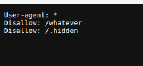
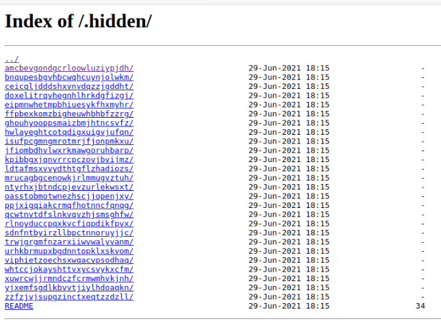
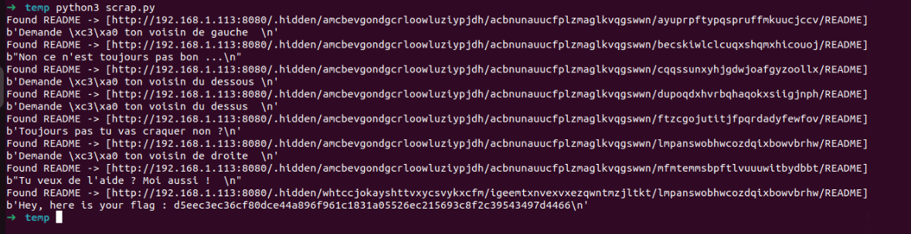

En allant sur le "robots.txt" du site, on obtient deux chemins à ne pas indexer.

On va s'occuper ici du chemin "/.hidden/" :

On tombe sur une foret de dossier.  
On pourrait les parcourir à la main (long et fastidieux), ou utiliser un script.  
On a utilisé un script en python et obtenu ça :

On finit par trouver un flag

L'offuscation à coup de foret de dossier et fichier, n'est pas une solution.  
On peut facilement contourner ce genre d'offuscation soit avec du temps, soit avec un script qui va parcourir l'arborescence de fichier.

On peut corriger ça en ne mettant pas le fichier dans un chemin même non indexer, car visible par le "robots.txt".

On peut aussi protéger certain fichier et chemin avec des ".htaccess" si vraiment, il y a des fichiers qui ne doivent pas être accédé (exemple les fichiers de configs du serveur).