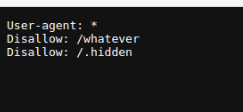
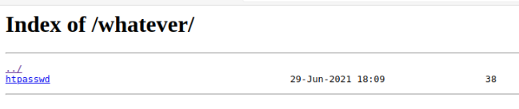

En allant sur le "robots.txt" du site, on obtient deux chemins à ne pas indexer.

On va s'occuper ici du chemin "/whatever/" :

Dans "htpasswd", on va trouver un couple id : hash.

On va donc chercher ce que l'on peut en faire.

En testant à plusieurs endroits, on finit par trouver une page admin sur le site.

On va donc essayer de-ci connecter.

Après avoir essayé avec le hash en tant que mot de pass, ce qui n'a pas marché.
J'ai donc essayé de décrypter le hash.

Au vu de la proportion de hash en md5 sur ce site, je vais tester avec ça en premier. Bingo, j'obtiens quelque chose.

En testant avec le résultat, on obtient le flag.

Pour se protéger de ce genre de cas, déjà ne pas garder ces mots de pass comme ça dans un fichier, même non-indexer.  
Il suffit de regarder le robots.txt pour les trouver comme ici.

On peut aussi protéger certain fichier et chemin avec des ".htaccess" si vraiment, il y a des fichiers qui ne doivent pas être accédé (exemple les fichiers de configs du serveur).