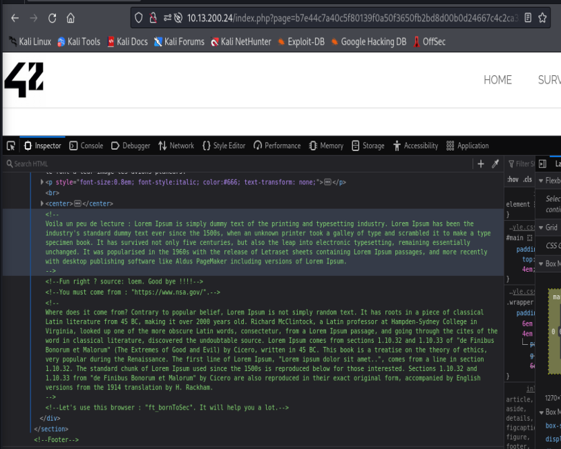
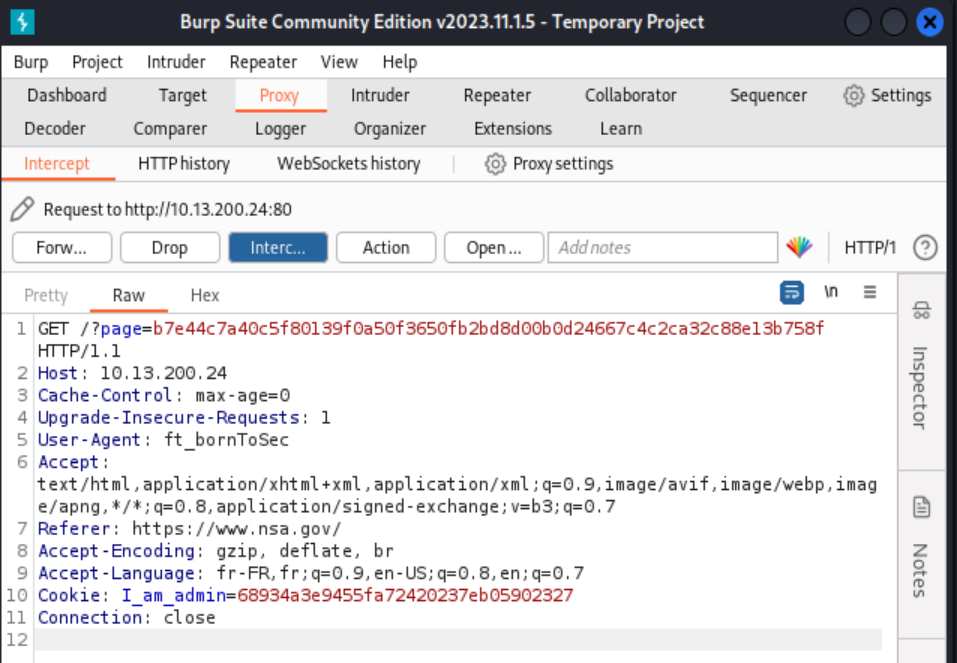

# Exploitation via User-Agent et Referer
**Date de découverte :** 23 février 2024

## Contexte
Dans le cadre de notre analyse de sécurité  une vulnérabilité a été identifiée permettant une exploitation via les en-têtes HTTP `User-Agent` et `Referer`.

## Procédure d'Exploitation
### Page Ciblée:
- La page vulnérable est accessible via l'URL suivante : `http://10.13.200.24/?page=b7e44c7a40c5f80139f0a50f3650fb2bd8d00b0d24667c4c2ca32c88e13b758f`.

### Indice dans les Commentaires:
- Des indices ont été trouvés dans les commentaires HTML de la page, suggérant une manipulation d'ou on doit provenir et du browser utiliser.

### Utilisation de Burp Suite:
- L'outil **Burp Suite** a été utilisé pour intercepter et modifier la requête HTTP vers la page vulnérable.
- **Modification de User-Agent** : L'en-tête `User-Agent` a été modifié pour contenir la valeur `ft_bornToSec`, simulant ainsi un navigateur spécifique.
- **Modification de Referer** : L'en-tête `Referer` a été modifié pour indiquer que la requête provenait de `https://www.nsa.gov/`, simulant une visite préalable à ce site.

## Impact Potentiel
Cette vulnérabilité peut permettre à un attaquant de bypasser les contrôles de sécurité basés sur les en-têtes HTTP `User-Agent` et `Referer`, menant potentiellement à des fuites d'informations, des accès non autorisés, ou d'autres impacts selon le contexte de l'application.

## Recommandations
- **Validation des En-têtes HTTP** : Renforcer la validation des en-têtes `User-Agent` et `Referer` pour s'assurer qu'ils ne sont pas utilisés de manière abusive pour bypasser la sécurité.
- **Utilisation de Mécanismes de Sécurité Additionnels** : Ne pas se reposer uniquement sur les en-têtes HTTP pour les contrôles de sécurité. Utiliser des mécanismes de sécurité additionnels tels que des tokens d'authentification, la validation de session, etc.

## Conclusion
La découverte de cette vulnérabilité met en évidence l'importance de ne pas se fier uniquement aux en-têtes HTTP comme mécanisme de contrôle de sécurité. L'application des recommandations fournies aidera à renforcer la sécurité de l'application web contre les tentatives d'exploitation similaires.
